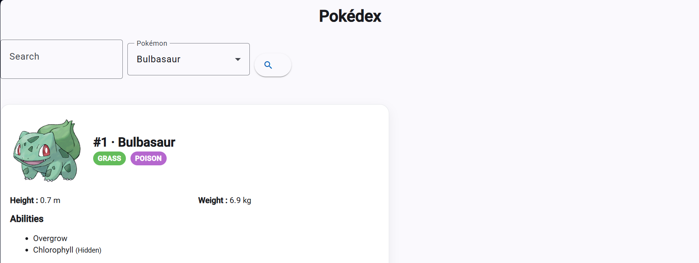
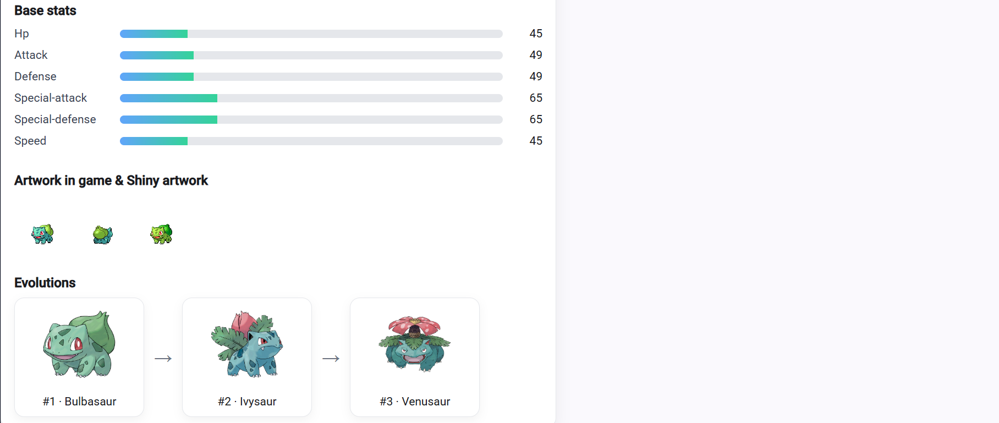

**PokeDemo — TP WE (Angular)**

Auteur : Gwendal CARIOU — 20202455 — M1 IL CLA

Résumé
-------

Ce projet est un mini Pokédex développé dans le cadre d'un TP Angular. Il consomme la PokeAPI (https://pokeapi.co) pour afficher des fiches détaillées de Pokémon, leurs statistiques et leurs évolutions.

Principales fonctionnalités
- Affichage des informations principales d'un Pokémon (nom, id, type).
- Détails étendus : taille, poids, statistiques de base (PV, Attaque, Défense, etc.).
- Affichage des artwork (version standard et shiny lorsque disponible).
- Navigation entre évolutions et sous-évolutions.

Capture d'écran du pokédex (Exemple de Bulbizarre)
--------------

Architecture & points techniques
-------------------------------

- Framework : Angular (v20+)
- API consommée : PokeAPI
	- `https://pokeapi.co/api/v2/pokemon/{id|name}` pour les stats et artwork
	- `https://pokeapi.co/api/v2/pokemon-species/{id|name}` pour récupérer la chaîne d'évolution

Remarque technique :
La récupération des évolutions a nécessité une étape supplémentaire car les informations d'évolution résident sur le endpoint `pokemon-species`. Le code du service a donc été adapté pour appeler successivement ces endpoints et agréger les données nécessaires à l'affichage. J'ai connu également des petites difficultés concernant les véritable artwork (en plus moderne) que j'ai récupéré sur github via un URL.

Structure du projet (extraits)
- `src/app/` : composants et services Angular
- `src/app/pokeinformations/` : composant d'affichage des fiches Pokémon
- `src/app/my-component/` : composant d'exemple
- `public/` : ressources statiques (images, placeholders)

Bonnes pratiques observées et que je vais réappliquer :
- Séparation service / composants pour faciliter les tests
- Utilisation de pipes pour filtrer/transformer l'affichage
